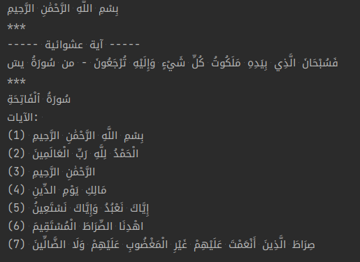
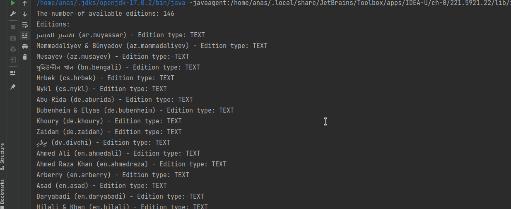
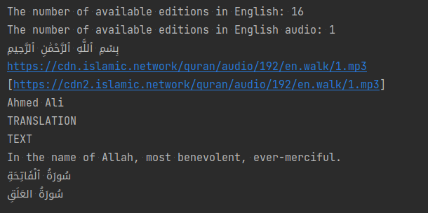

# A simple java wrapper library for [alquran-cloud api](https://alquran.cloud/api) 🤍

[](https://jitpack.io/#anas-elgarhy/alquran-cloud-api)
[](https://sonarcloud.io/summary/new_code?id=anas-elgarhy_alquran-cloud-api)
[](https://sonarcloud.io/summary/new_code?id=anas-elgarhy_alquran-cloud-api)
[](https://sonarcloud.io/summary/new_code?id=anas-elgarhy_alquran-cloud-api)
[](https://sonarcloud.io/summary/new_code?id=anas-elgarhy_alquran-cloud-api)
[](https://sonarcloud.io/summary/new_code?id=anas-elgarhy_alquran-cloud-api)
[](https://sonarcloud.io/summary/new_code?id=anas-elgarhy_alquran-cloud-api)
[](https://sonarcloud.io/summary/new_code?id=anas-elgarhy_alquran-cloud-api)

## It still under development 🚧


## How to add this library into your project

### Maven

**Step 1**. Add the JitPack repository to your build file

```xml

<repositories>
	<repository>
		<id>jitpack.io</id>
		<url>https://jitpack.io</url>
	</repository>
</repositories>
```

**Step 2**. Add the dependency

```xml
<dependency>
	<groupId>com.github.anas-elgarhy</groupId>
	<artifactId>alquran-cloud-api</artifactId>
	<version>0.3.0-v1</version>
</dependency>
```

#### Gradle:

**Step 1**. Add the JitPack repository to your build file<br>
*Add it in your root build.gradle at the end of repositories:*

```gradle
allprojects {
    repositories {
        ...
        maven { url 'https://jitpack.io' }
    }
}
```

**Step 2**. Add the dependency

```gradle
	dependencies {
	        implementation 'com.github.anas-elgarhy:alquran-cloud-api:0.3.0-v1'
	}
```

## Usage
```java
public class Example1 {
    public static void main(String[] args) throws IOException {
        Ayah ayah = QuranAPI.getAyah(1); // Get the first ayah in the quaran in arabic edition
        System.out.println(ayah.getText());
        System.out.println("***");

        System.out.println("----- آية عشوائية -----");
        Ayah randomAyah = QuranAPI.getRandomAyah(); // Get a random ayah in the quaran in arabic edition
        Surah surah = randomAyah.getSurah(); // Get the surah of the random ayah
        System.out.println(randomAyah.getText() + " - من " + surah.getName());
        System.out.println("***");

        Surah surah2 = QuranAPI.getSurah(1); // Get the first surah in the quaran in arabic edition
        System.out.println(surah2.getName());
        System.out.println("الآيات: ");
        for (Ayah a : surah2.getAyahs()) {
            System.out.println(a.getText() + " (" + a.getNumberInSurah() + ")");
        }
    }
}

```


```java
public class Example2 {
    public static void main(String[] args) throws IOException {
        Edition[] editions = QuranAPI.getEditions(); // Get all available editions
        System.out.println("The number of available editions: " + editions.length);

        System.out.println("Editions: ");

        for (Edition edition : editions) {
            System.out.println(edition.getName() + " (" + edition.getIdentifier() + ")" +
                    " - Edition type: " + edition.getFormat().toString());
        }
    }
}
```


```java
public class Example3 {
    public static void main(String[] args) throws IOException {
        // Get th all available editions in specific language
        Edition[] editionsInEnglish = QuranAPI.getEditions("en");
        System.out.println("The number of available editions in English: " + editionsInEnglish.length);


        // Get th all available editions in specific language and format (audio or text) and type (quran or translation, etc)
        // null means all
        Edition[] editionsInEnglishAudio = QuranAPI.getEditions(EditionFormat.AUDIO, "en", null);
        System.out.println("The number of available editions in English audio: " + editionsInEnglishAudio.length);

        Ayah ayah = QuranAPI.getAyah(1, editionsInEnglishAudio[0]); // Get the first ayah in the quaran in specific edition
        // Becose the audio editions also have the text editions insiw, and usually the text editions are arabic.
        System.out.println(ayah.getText());
        System.out.println(ayah.getAudioUrl()); // Get the audio url of the ayah in 192 kbps.
        // Get the audio urls in other bitrates, returns same url if no other bitrates.
        System.out.println(Arrays.toString(ayah.getSecondaryAudioUrls()));

        Edition edition = editionsInEnglish[0];
        System.out.println(edition.getName());
        System.out.println(edition.getType());
        System.out.println(edition.getFormat());

        Ayah ayahFromEdition = QuranAPI.getAyah(1, edition); // Get the first ayah in the quaran in specific edition
        System.out.println(ayahFromEdition.getText());

        // Get the first surah in the quaran in specific edition
        Surah fistSurah = QuranAPI.getSurah(1, edition);
        System.out.println(fistSurah.getName());

        // Or you can use the Surah enum to get the surah:
        Surah s = QuranAPI.getSurah(Surahs.AL_ALAQ);
        System.out.println(s.getName());
    }
}
```


## Requirements for development:
- Maven
- jdk 17
- IntelliJ IDEA (not required but recommended)


### Available in

[](https://github.com/anas-elgarhy/alquran-cloud-api)
[](https://gitlab.com/anas-elgarhy/alquran-cloud-api)
[](https://bitbucket.org/anas_elgarhy/alquran-cloud-api)
[](https://codeberg.org/anas-elgarhy/alquran-cloud-api)

[](https://sonarcloud.io/summary/new_code?id=anas-elgarhy_alquran-cloud-api)

[](https://sonarcloud.io/summary/new_code?id=anas-elgarhy_alquran-cloud-api)
